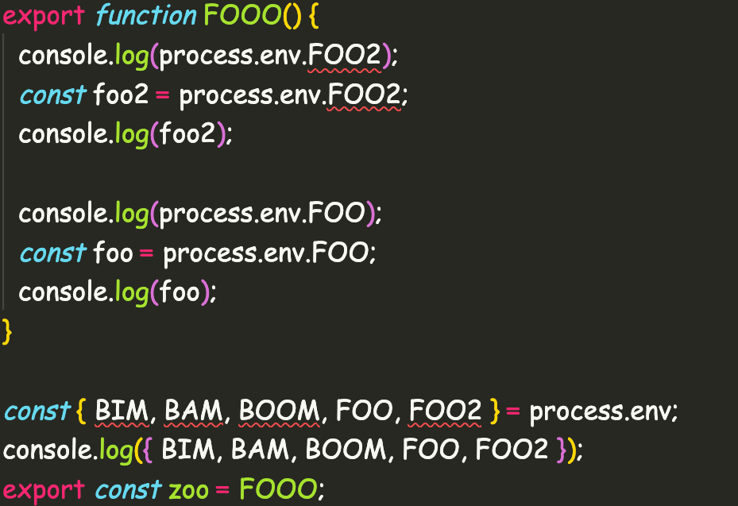

# More?

## ESLint?

- different AST structures
  - no more unist
  - no more typescript native
- selectors instead

## Selectors

```typescript
export const geller: any = createRule({
  create(context) {
    const { envs, cwd } = context.options?.[0] || {};
    const dotEnvVars = getDotEnvVarsSync(envs, cwd);

    return {
      MemberExpression(node) {
        const nodeAny = node as any;

        if (
          nodeAny?.object?.name === "process" &&
          nodeAny.property.name === "env"
        ) {
          const property = (node.parent as any)?.property;
          const member = property?.name;
```

## Example



## What is the most environmentally friendly video game?

## Call of Duty. It gets recycled every year!


